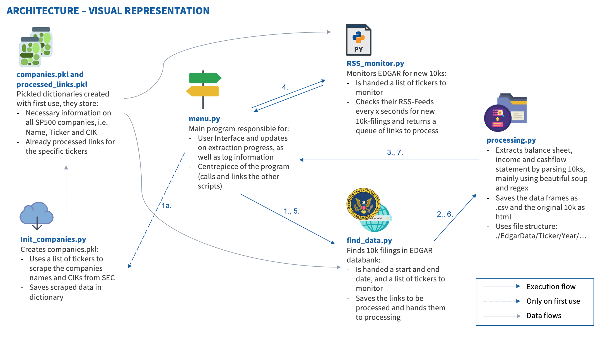

# edgar_scraping

This project is designed to help people extract cashflow statements, balance sheets and income statement of SP500 companies from their 10-Ks the SEC Edgar Database.

<strong>Options:</strong>

- Continious "monitoring" mode vs one-time request

- Single company or group of companies

- Point in time or timeframe

<strong>Possible future work:</strong> I was considering to create a SQL databank and save the actual datapoints (e.g. income, R&D spenfing, interest, Total Assets, Net cashflow from operating activities...) to it. However, during the course of my work I discovered that the entries of the balance sheet and income/cashflow statements were extremely different from company to company (i.e. ). Though I have thought about different ways to solve this issue (i.e. ), I've decided that implementing any of them would exceed the scope of a unpaid, private project. Therefore, for now, the standardisation and possible analysis of the data scraped remains future work.

